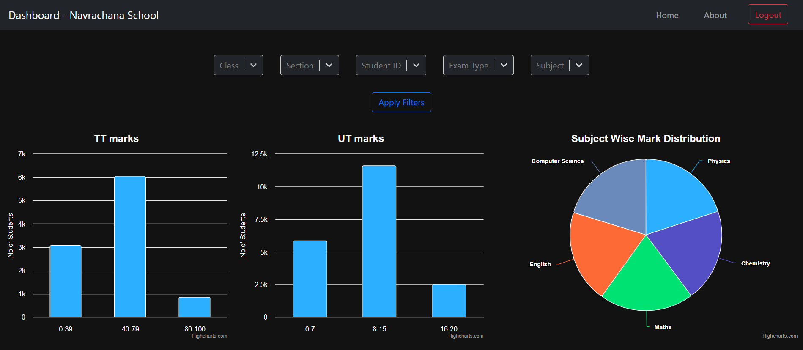

<h1> Analytics Dashboard </h1>

A full-stack web app of a Student Performance Analytics Dashboard that streamlines the process of analyzing and visualizing class and student data for school teachers. 
   
This project was made as a summer project for a Bangalore-based startup called 7Sages Solutions LLP. I was tasked to identify a tech stack suitable to their needs and build a robust and scalable prototype.
     

 
<h2> Objectives </h2>
<ul>
    <li> Simplify the management and analysis of student performance data for schools and teachers with large class sizes. </li>
    <li> Enhance academic growth in students in environments with high student-teacher ratio. </li>
    <li> Provide teachers with a centralized platform to track and monitor collective and individual progress, identifying areas for improvement. </li>
    <li> Facilitates data-driven decision-making as it helps teachers to identify trends, patterns and areas of improvement </li>
</ul>

<h2> Tech Stack </h2>
<h4> Front End </h4>
<ul>
    <li> ReactJS </li>
    <li> Bootstrap </li>
    <li> Plotly </li>
    <li> HighCharts </li>
    <li> Nivo </li>
</ul>

<h4> Back End </h4>
<ul>
    <li> Flask </li>
    <li> MySQL </li>
</ul>

<h4> Authentication </h4>
<ul>
    <li> Firebase Auth </li>
</ul>

<h2> Instructions </h2>
<ol>
    <li> 
        Clone the repository.   
        <code>git clone https://github.com/aditdesai/dashboard.git</code>
    </li>
    <li> Link app to a mock database of your own. </li>
    <li> Go to the /api subdirectory. </li>
    <li> 
        Activate the virtual environment.  
        <code>.\venv\Scripts\activate.ps1</code>
    </li>
    <li>
        Run the Flask API.  
        <code>python .\app.py</code>
    </li>
    <li> Go to the root subdirectory. </li>
    <li> 
        Install all dependencies  
        <code>npm i</code>
    </li>
    <li> 
        Run the React app.  
        <code>npm start</code>
    </li>
</ol>